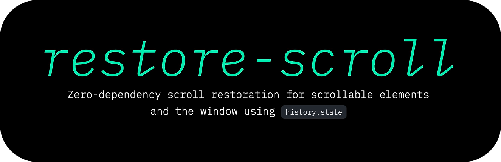

[](https://restore-scroll.netlify.app)

<div align="center">

[](https://github.com/hirasso/restore-scroll/actions/workflows/e2e-tests.yml)
[](https://github.com/hirasso/restore-scroll/actions/workflows/unit-tests.yml)
<!--[](https://www.npmjs.com/package/restore-scroll)-->
[](https://github.com/hirasso/restore-scroll/blob/main/LICENSE)

</div>

## Demo

[restore-scroll.netlify.app](https://restore-scroll.netlify.app)

## Installation

Install and import into your bundle

```bash
npm i @hirasso/restore-scroll
```

```js
import { restoreScroll } from "@hirasso/restore-scroll";
```

Or import the module directly from a CDN for quick tests:

```html
<script type="module">
  import { restoreScroll } from "https://unpkg.com/@hirasso/restore-scroll@0?module";
</script>
```

## Usage

```js
/**
 * Store the scroll position all overflowing divs (identified by tailwind classes in this case):
 */
document
  .querySelectorAll(".overflow-y-auto,.overflow-x-auto,.overflow-auto")
  .forEach((el) => restoreScroll(el));
```

💡 If `history.scrollRestoration` is set to `manual`, you might want to restore the window scroll position as well:

```js
window.history.scrollRestoration = "manual";
restoreScroll(window);
```

## Arguments

The first argument `target` accepts either an element or the `Window`:

```ts
export type Target = Element | Window;
```

The second argument `options` accepts this:

```ts
type Options = {
  debug?: boolean;
  events?: {
    "store"?: (el: Element, event: CustomEvent<position: ScrollPosition>) => void,
    "restore"?: (el: Element, event: CustomEvent<position: ScrollPosition>) => void,
  }
}
```

## Options

### `debug`

Type: `boolean`, default: `false`. Log debug info to the console

## Events

Listening to events can be done in two ways:

### Option 1: Attach listeners declaratively

```ts
import { restoreScroll } from "@hirasso/restore-scroll";
restoreScroll(el, {
  events: {
    store: (el, event) => console.log("stored", el, event),
    restore: (el, event) => console.log("restored", el, event),
  },
});
```

### Option 2: Attach listeners to the element directly

DOM events are prefixed with `restore-scroll:`:

```ts
import { restoreScroll } from "@hirasso/restore-scroll";
const el = document.querySelector("#foo");
el.addEventListener("restore-scroll:restore", (e) => {
  const event = e as CustomEvent<{ position: ScrollPosition }>;
  /** The position is available in event.detail.position */
  console.log(event.detail.position);
});
restoreScroll(el);
```

`event.preventDefault` works as expected:

```ts
restoreScroll(el, {
  events: {
    restore: (el, event) => {
      if (someCondition()) {
        /** The element won't be restored */
        event.preventDefault();
      }
    },
  },
});
```
